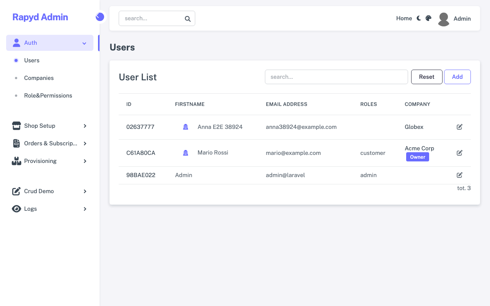
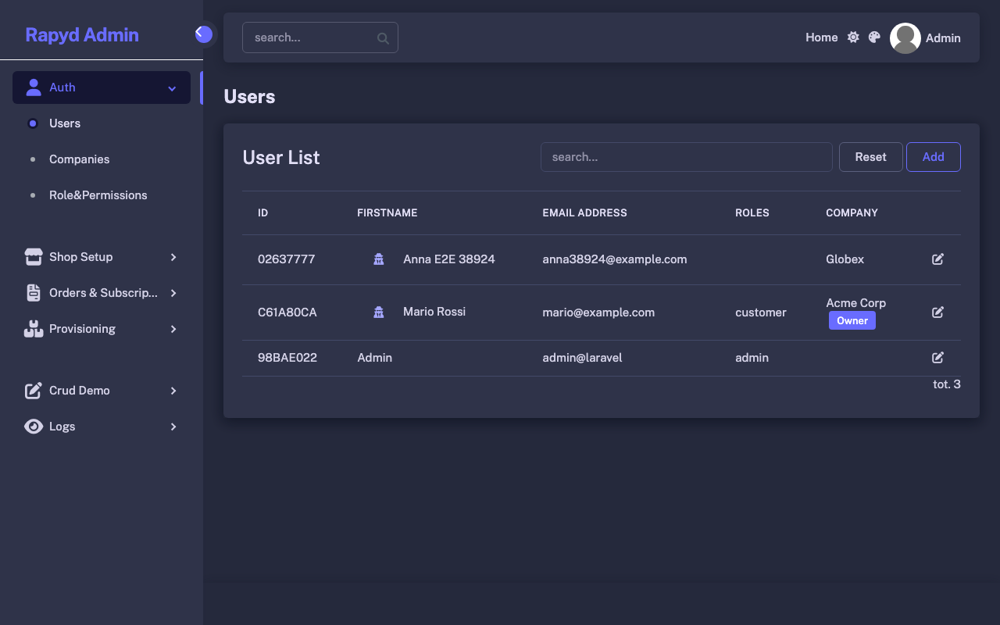

# Rapyd Admin — Sneat theme

[Sneat](https://github.com/themeselection/sneat-bootstrap-html-admin-template-free) (free edition, MIT, Bootstrap 5.3)
as the admin, public and auth layouts of [Rapyd Admin](https://github.com/zofe/rapyd-admin). It follows the layout
contract in `docs/THEMES.md` of the package: same modules, same `x-rpd::` components, a different shell.



<details><summary>Dark mode</summary>



</details>

## Install

```bash
composer require zofe/theme-sneat
php artisan vendor:publish --tag=rapyd-theme-sneat --force   # public/vendor/themes/sneat
```

```dotenv
RAPYD_THEME=sneat
```

`php artisan rpd:theme:check` confirms the theme fulfils the contract. Remove the variable to go back to the bundled
look, or set `RAPYD_THEME_SWITCH=true` to let each visitor pick a theme from the navbar.

## What it changes

- `resources/views/{app,admin,frontend,auth}.blade.php` and `includes/`: Sneat's vertical menu (`layout-menu`, collapsible
  to icons from the xl breakpoint, off-canvas below), detached navbar with search, user menu and light/dark toggle,
  page title with breadcrumbs, footer.
- `resources/views/rpd/components/`: `nav-dropdown`, `nav-link`, `nav-item`, `breadcrumbs` rendered as Sneat menu
  items, so the menus of the modules need no change.
- `resources/sass/sneat/`: Sneat's SCSS (MIT, licence included) compiled against the Bootstrap of rapyd-admin, with
  `_custom-variables/` for overrides; `resources/sass/theme.scss` adds `rapyd-base` (the rapyd components), the runtime
  palette mapped onto Sneat's `--bs-menu-bg` / `--bs-navbar-bg`, and a dark mode (Sneat free ships the light style only).
- `resources/js/theme.js`: rapyd's `rapyd-core` (Bootstrap, TomSelect, modals, theme switcher, livewire-sortable) plus
  a small `menu.js` for the vertical menu; Sneat's own `menu.js` / `helpers.js` are not needed.
- Icons: Font Awesome (used by the rapyd components) and the Public Sans font are loaded from CDNs.

## Build

```bash
composer install        # brings zofe/rapyd-admin, whose resources the build imports
npm i
npm run dev             # vite build --watch → public/
npm run build
```
